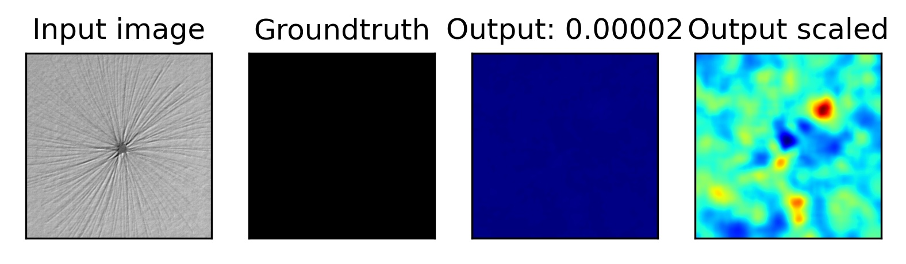
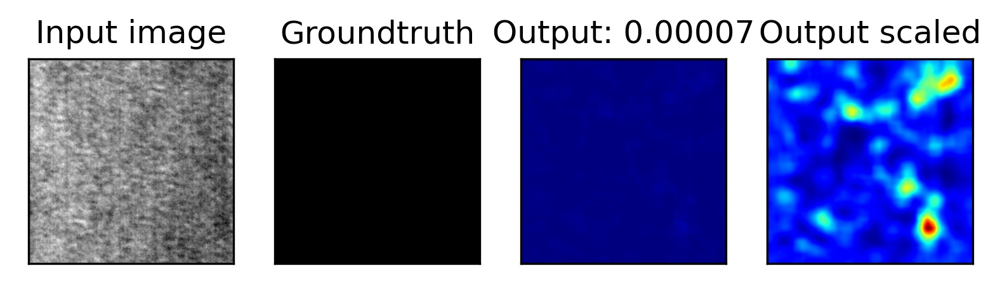
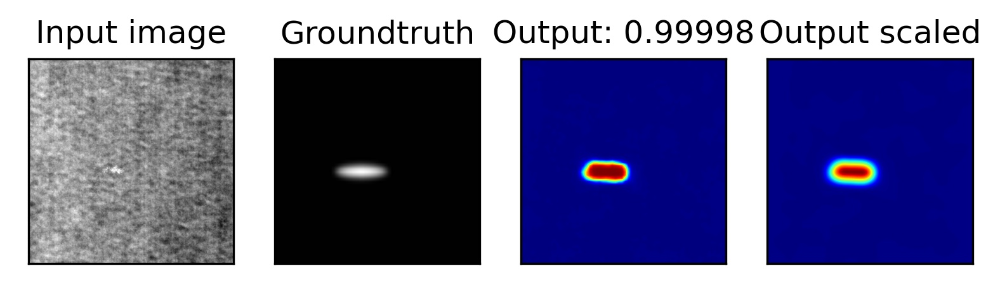

```
@article{Bozic2021COMIND,
  author = {Bo{\v{z}}i{\v{c}}, Jakob and Tabernik, Domen and 
  Sko{\v{c}}aj, Danijel},
  journal = {Computers in Industry},
  title = {{Mixed supervision for surface-defect detection: from weakly to fully supervised learning}},
  year = {2021}
}
```
This method uses a 2 stage neural network for segmentation and classification.
Inference time : Still training


Using DAGM 2007 dataset







The above images were obtained by reproducing the reseults mentioned in the paper. [code available here](https://github.com/vicoslab/mixed-segdec-net-comind2021)
Using CUDA 10.1
